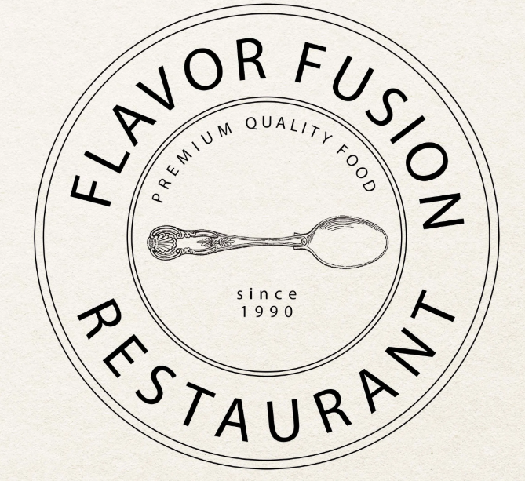

<!DOCTYPE html>
<html lang="en">
<head>
    <meta charset="UTF-8">
    <meta name="viewport" content="width=device-width, initial-scale=1.0">
    <title>Hotel TGB</title>
    <link rel="stylesheet" href="css/bootstrap.min.css">
    
    
    
    
</head>
<body>
    <nav class="navbar navbar-expand-lg navbar-dark bg-dark">
        

            
            <a class="navbar-brand" href="#">THE GRAND BHAGWATI</a>
            <button class="navbar-toggler" type="button" data-toggle="collapse" data-target="#navbarNav">
                
            </button>
            

                <ul class="navbar-nav ml-auto">
                    <li class="nav-item"><a class="nav-link" href="about">ABOUT US</a></li>
                    <li class="nav-item"><a class="nav-link" href="#accommodations">ACCOMMODATIONS</a></li>
                    <li class="nav-item"><a class="nav-link" href="#dining">DINING</a></li>
                    <li class="nav-item"><a class="nav-link" href="#events">EVENTS</a></li>
                    <li class="nav-item"><a class="nav-link" href="#packages">PACKAGES</a></li>
                    <li class="nav-item"><a class="nav-link" href="#takeaway">TAKE AWAY</a></li>
                    <li class="nav-item"><a class="nav-link" href="#contact">CONTACT US</a></li>
                </ul>
            

        

    </nav>

    <header>
            
    </header>

    <section id="about" class="text-center">
        

            <h2>About Us</h2>
            
The Grand Bhagwati is a chain of hotels known for its excellent food, distinguished hospitality, magnificent banquet space, and outdoor catering segment across India.

        

    </section>

    <section id="booking-details" class="bg-light text-center">
        

            <h2>Booking Details</h2>
            <form id="hotel-booking-form" class="p-4 shadow-lg bg-white rounded">
                

                    <label for="check-in-date">Check-In Date:</label>
                    <input type="date" name="check-in" class="form-control" required >
                

                

                    <label for="check-out-date">Check-Out Date:</label>
                    <input type="date" name="check-out" class="form-control" required>
                

                

                    <label for="room-type">Room Type:</label>
                    <select id="room-type" name="room-type" class="form-control" required>
                        <option value="single">Single Room</option>
                        <option value="double">Double Room</option>
                        <option value="suite">Suite</option>
                    </select>
                

                

                    <label for="guest-count">Number of Guests:</label>
                    <input type="number" name="guests" class="form-control" min="1" required>
                

                <button type="submit" class="btn btn-primary btn-block">Book Now</button>
            </form>
        

    </section>
    <section id="contact" class="text-center">
        

            <h2>Contact Us</h2>
            
Email: info@hoteltgb.com

            
Phone: +1234567890

        

    </section>

    <footer>
        

            
© 2025 Hotel TGB. All rights reserved.

        

    </footer>
    <section id="about" class="container my-5">
        <h2 class="text-center mb-4">About Us</h2>
        
    </section>
</body>
</html>
